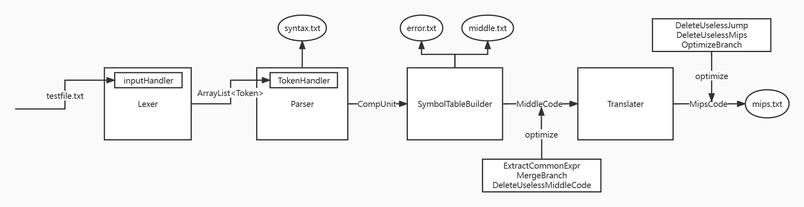
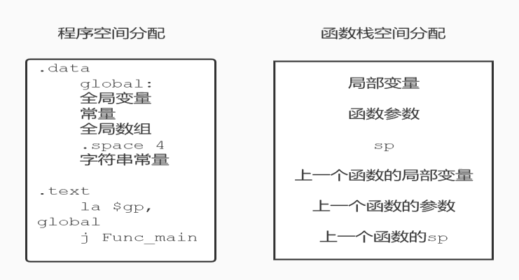

# BUAA_Compiler_2022

------------
### 北京航空航天大学2022秋编译技术课程设计
#### Java语言实现的SysY到Mips编译器

### 基础功能
- [x] 词法分析
- [x] 语法分析
- [x] 符号表管理
- [x] 中间代码
- [x] 错误处理
- [x] 代码生成

### 前端优化
- [x] 小型函数内联
- [x] 常量传播
- [x] 复写传播
- [x] 编译期计算
- [x] 表达式翻译优化
- [x] 分支语句翻译优化
- [x] 活跃变量分析，死代码删除

### 后端优化
- [x] 图着色全局寄存器分配策略
- [x] OPT临时寄存器分配策略
- [x] 立即数乘除优化
- [x] 后端无用跳转语句删除
- [x] 后端无用赋值语句删除

--------------

- 总体架构
  

- 目标代码空间分配策略
  

- [文档](https://github.com/dhcpack/BUAA_Compiler_2022/tree/main/src/Docs)
  https://github.com/dhcpack/BUAA_Compiler_2022/tree/main/src/Docs